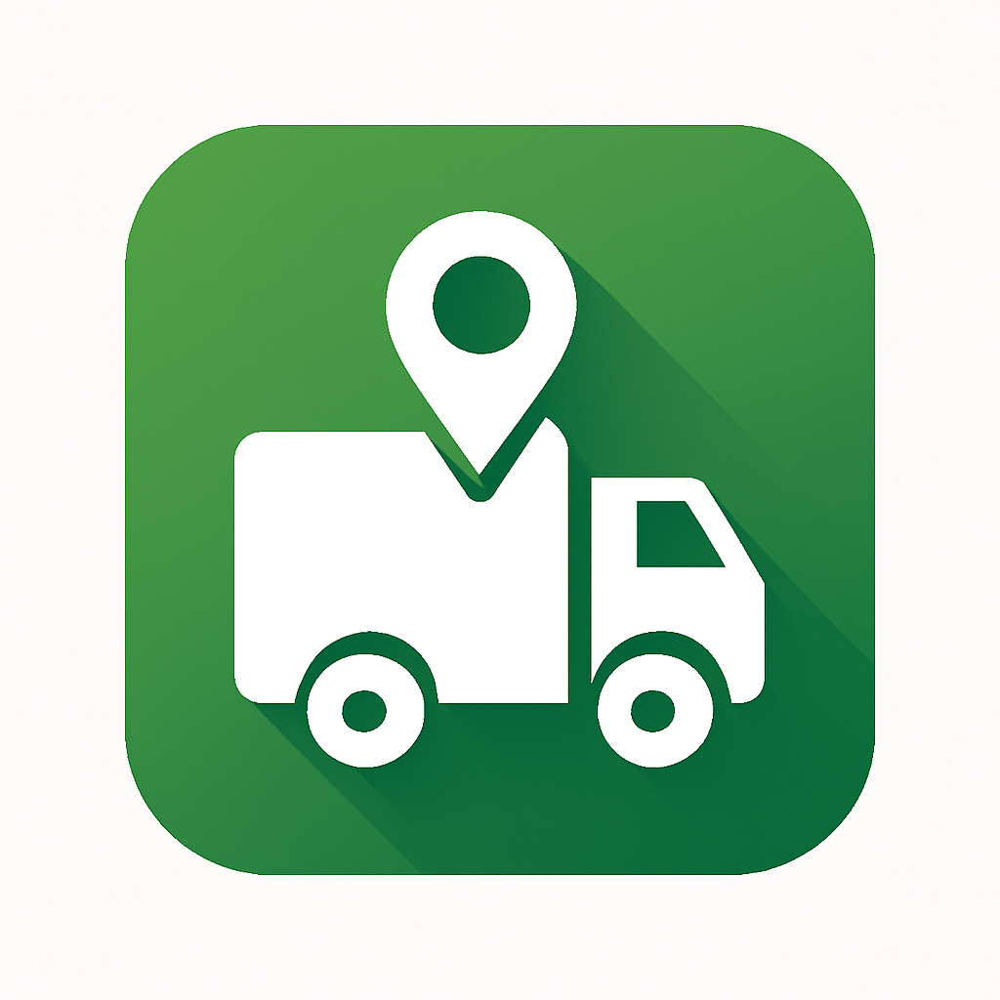

# DeliveryGo

  

## Descrizione del progetto

**DeliveryGo** è un sistema avanzato di logistica intelligente che ottimizza la gestione delle consegne in tempo reale. Progettato per migliorare l'efficienza dei camionisti e ridurre i tempi di consegna, **DeliveryGo** integra l'ottimizzazione delle rotte, il tracciamento in tempo reale, e la gestione delle anomalie.

Il sistema è composto da un'applicazione mobile per i camionisti, un backend basato su microservizi, e un algoritmo di ottimizzazione che utilizza modelli predittivi per gestire le rotte, la capacità dei veicoli, le finestre temporali di consegna e la disponibilità dei camionisti.

### Funzionalità principali:
- **Ottimizzazione delle rotte**: Calcolo delle migliori rotte in base a vincoli di tempo, capacità del veicolo e disponibilità dei camionisti.
- **Gestione delle anomalie**: Rilevamento e gestione di situazioni anomale, come guasti ai veicoli o deviazioni dalla rotta.
- **Tracciamento GPS in tempo reale**: Monitoraggio continuo della posizione dei veicoli tramite GPS, con aggiornamenti sulla mappa.
- **Gestione ordini**: Assegnazione da parte dell'admin degli ordini ai camionisti e gestione delle loro attività (accettazione e completamento delle tratte).

### Obiettivi:
- **Ottimizzare i percorsi** per permettere all'admin di gestire gli ordini in maniera ottimale.
- **Fornire notifiche in tempo reale** ai camionisti e agli admin su eventi critici come guasti o deviazioni, o avvisare l'utente di un'assegnazione.
- **Gestione anomalie** per permettere all'admin di intervenire subito in caso di guasto.

---

## Architettura del Sistema

Il sistema è progettato con un'architettura **a microservizi**, che consente una gestione scalabile e modulare. I vari componenti sono sviluppati come servizi indipendenti che comunicano tramite API RESTful.

  

### Componenti principali:

1. **PositionService**: Gestisce tutto ciò che riguarda l'utente, incluse le informazioni di registrazione, aggiornamento del profilo 
2. **DeliveryService**: Si occupa della gestione degli ordini e delle rotte, inclusa l'assegnazione dei veicoli agli ordini e l'ottimizzazione del percorso.
3. **VehicleRoutingService**: Responsabile del calcolo delle rotte ottimizzate per i veicoli, utilizzando algoritmi come OR-Tools per risolvere il CVRPTW (Capacitated Vehicle Routing Problem with Time Windows).
4. **NotificationService**: Gestisce l'invio di notifiche push ai camionisti e agli admin, incluse le notifiche di aggiornamento delle rotte e segnalazione di anomalie.

### Tecnologia utilizzata:
- **Backend**: Java (Spring Boot) per la logica di business e il supporto delle API RESTful.
- **Frontend**: React Native per l'applicazione mobile dei camionisti.
- **Database**: MongoDB per la gestione dei dati relativi agli ordini e ai veicoli.
- **Ottimizzazione rotte**: OR-Tools, GraphHopper per il calcolo delle rotte.
- **Tracciamento GPS**: MQTT per l'invio della posizione in tempo reale.

---

## Frontend

L'app mobile, sviluppata con **React Native**, consente ai camionisti di:

- Gestire il proprio profilo.
- Visualizzare la rotta ottimizzata.
- Ricevere notifiche push a tratta assegnata
- Aggiornare la propria posizione in tempo reale.

Mentre consente agli admin di:

- Creare e gestire veicoli, ordini e rotte.
- Assegnare tratte ai camionisti.
- Visualizzare lo stato di ordini e veicoli.
- Gestione automatica delle anomalie
  
L'app comunica con il **backend** tramite API RESTful sicure. Il sistema di notifica è integrato con **Firebase Cloud Messaging (FCM)** per inviare alert sui cambiamenti in tempo reale.

---

## Repository dei Componenti

### Componenti del Sistema:
- PositionService: [Repository PositionService](https://github.com/UniSalento-IDALab-IoTCourse-2024-2025/wot-project-PositionService-MandorinoSettimo)
- DeliveryService: [Repository DeliveryService](https://github.com/UniSalento-IDALab-IoTCourse-2024-2025/wot-project-DeliveryService-MandorinoSettimo)
- VehicleRoutingService: [Repository VehicleRoutingService](https://github.com/UniSalento-IDALab-IoTCourse-2024-2025/wot-project-VehicleRoutingProblem-MandorinoSettimo)
- NotificationService: [Repository NotificationService](https://github.com/UniSalento-IDALab-IoTCourse-2024-2025/wot-project-NotificationService-MandorinoSettimo)

### Repository Frontend:
- *Frontend*: [Repository Frontend](https://github.com/UniSalento-IDALab-IoTCourse-2024-2025/wot-project-Frontend-MandorinoSettimo)

---

## Approfondimento su **NotificationService**

Il **NotificationService** gestisce l'invio di notifiche push ai camionisti e agli amministratori del sistema. Le notifiche vengono utilizzate per informare gli utenti su eventi critici, come la modifica di una rotta, l'assegnazione di un nuovo ordine o l'avviso di un'anomalia (guasto, deviazione, ecc.).

### Funzionalità principali di **NotificationService**:
- **Notifiche Push**: Invia notifiche push ai camionisti e agli amministratori tramite Firebase Cloud Messaging (FCM).
- **Notifiche di aggiornamento**: Informa i camionisti sui cambiamenti delle rotte e degli ordini.
- **Gestione delle anomalie**: Invia avvisi in tempo reale su guasti ai veicoli, deviazioni dalle rotte o altri eventi imprevisti.
- **Stato delle notifiche**: Permette agli amministratori di monitorare lo stato delle notifiche inviate.

### Tecnologie utilizzate:
- **Spring Boot** per la gestione delle API e dei servizi.
- **Firebase Cloud Messaging (FCM)** per l'invio di notifiche push.
- **Database**: MongoDB per memorizzare le notifiche inviate e lo stato delle stesse.
